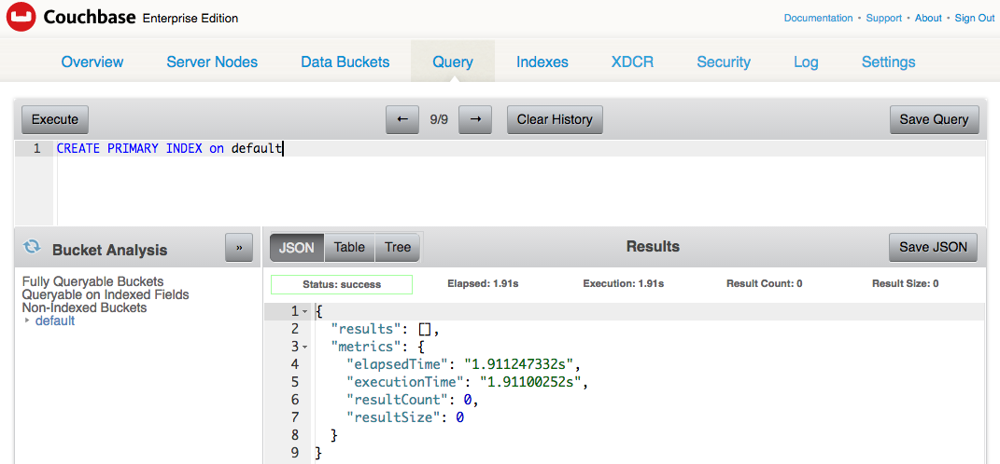

:toc:
:icons: font
:source-highlighter: prettify
:project_id: python-sdk

= Getting started with Couchbase and the Python SDK

This guide explains how to use http://developer.couchbase.com/documentation/server/current/sdk/python/start-using-sdk.html[Couchbase Python SDK] to store and retrieve a JSON document in http://developer.couchbase.com/server[Couchbase].

== What you'll build

Couchbase is an open source NoSQL document database. It can be programmed using a variety of languages. This guide will show how to write a simple Python application to store a JSON document representing a Book JSON document in Couchbase Server using the Couchbase Python SDK.

== What you'll need

* 15-30 minutes
* A Python code editor
* http://www.couchbase.com/nosql-databases/downloads[Couchbase Server 4.5+]

== Setup

=== Install and Start Couchbase

Install and start Couchbase for your operating system as explained at: http://developer.couchbase.com/documentation/server/current/getting-started/installing.html. A default bucket by the name `default` is created for you.

Open up Couchbase Web Console at http://localhost:8091, go the Query tab, create a primary index using `CREATE PRIMARY INDEX on default` and click on Execute button to create the index.



Status shows that the index was successfully created.

=== Install Python Client SDK

Couchbase Python Client SDK can be installed on different operating systems. Complete set of instructions are available at http://developer.couchbase.com/documentation/server/current/sdk/python/start-using-sdk.html. OSX specific instructions are given below.

Installing Python Client SDK on OSX requires to install `brew` package manager. This in turn requires to install XCode and the process could take a few minutes depending upon your connectivity. 

. Download and Install https://itunes.apple.com/au/app/xcode/id497799835?mt=12[XCode].
. Install the XCode CLI tools as `xcode-select --install`.
. Install `brew` package manager as:
+
```
ruby -e "$(curl -fsSL https://raw.githubusercontent.com/Homebrew/install/master/install)"
brew doctor
```
+
. Now you are ready to install Couchbase Python libraries:
+

```
brew install libcouchbase
brew install python
pip install couchbase
```
+
This will first install the `libcouchbase` library, then Python interpreter, and finally the Couchbase Python library.

== Code

== Create Application

In your favorite editor, create a new file `app.py`. Copy the following code in that file:

[source,python]
----
from couchbase.bucket import Bucket
from couchbase.n1ql import N1QLQuery

# Connect to Couchbase
bucket = Bucket('couchbase://localhost/default')

# Upsert a document in the bucket
bucket.upsert("book1", {
  "isbn": "978-1-4919-1889-0",
  "name": "Minecraft Modding with Forge",
  "cost": 29.99
})

# retrieve and print the document
print(bucket.get("book1").value)

# retrieve and print all the documents
query = N1QLQuery("SELECT isbn, name, cost FROM `default`")
for row in bucket.n1ql_query(query):
    print(row)
----

`Bucket` class creates a connection to the Couchbase node identified by `localhost`. It also opens up the `default` bucket.

A JSON document is upserted in the bucket. The word `"upsert"` comes from `"update"` and `"insert"`. So this method will either insert the document if it does not exist, or update if it already exists. A fresh install of Couchbase has an empty `default` bucket. So the document will be inserted for the first run. Subsequent runs of this application will update the document.

A key is given to identify the document, this is `book1` in our case. The document itself is the JSON fragment and is the second parameter of the method.

The inserted document can be easily accessed using `bucket.get()` method and passing the key used during the creation. Value of the document can be retrieved using `.value`.

All documents from the bucket can be easily retrieved using http://couchbase.com/n1ql[N1QL] query as well.

== Run

Open a terminal or command prompt and give the command `python app.py` to run the application. It will show the output as:

[source, text]
----
{u'cost': 29.99, u'isbn': u'978-1-4919-1889-0', u'name': u'Minecraft Modding with Forge'}
{u'cost': 29.99, u'isbn': u'978-1-4919-1889-0', u'name': u'Minecraft Modding with Forge'}
----

The first result comes from `print(bucket.get("book1").value)` method. The second line comes from executing the N1QL query and iterating over all the documents.

== Summary

Congratulations! You set up a Couchbase server and wrote a simple Python application that stores and retrieves a JSON document in Couchbase.

